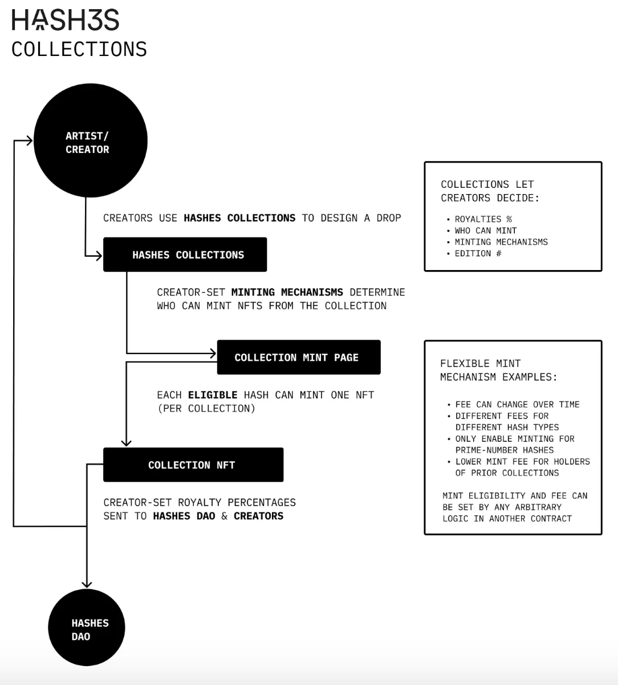
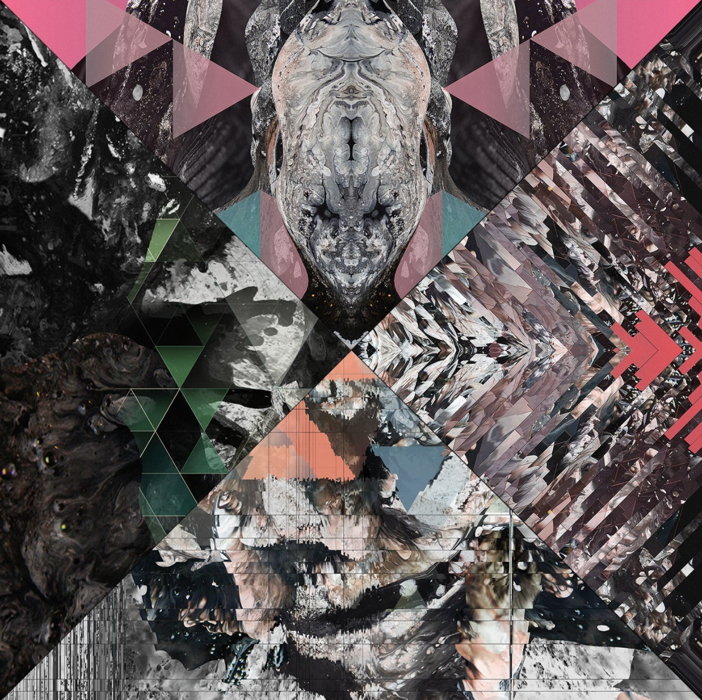
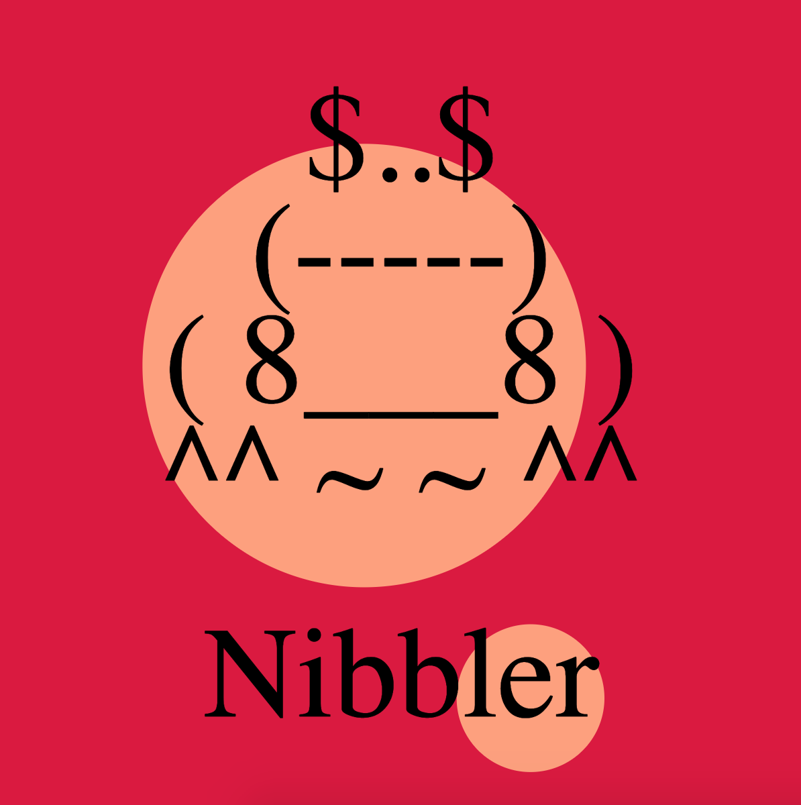
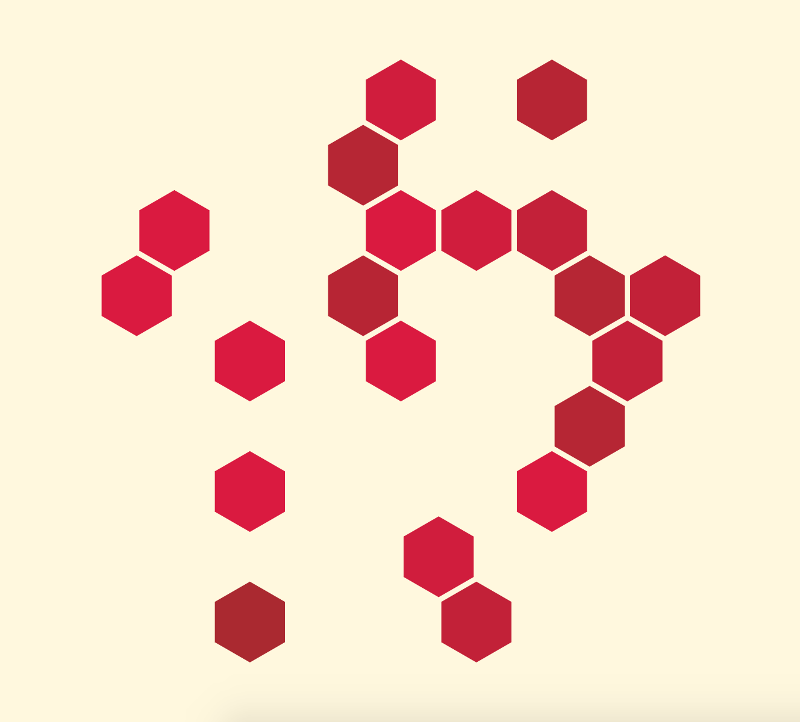

# Hashes Collections

One drawback of the Permutation model of DAO governance and operations is the risk of siloed work environments, along with a proliferation of isolated projects that lack consistency and a sense of higher-level cohesion. In order to resolve this, the Hashes DAO has built a flexible and composable NFT [factory](https://etherscan.io/address/0x86cf8621b3ee3eb77d7effe9dc677d1cd39e9ce5). This factory acts as both a registry for Hashes NFT collections, while also helping to lower the technical barriers to entry for anyone interested in creating an NFT collection on Ethereum.

### Collection Factory

At a high level, the collection factory allows anyone to create an ERC721 NFT collection, known as a Hashes collection, which is automatically integrated into the Hashes DAO ecosystem and website. Artists and creators have a wide range of flexibility concerning the supply, mint fee, royalty, mint eligibility, allow listing, revenue sharing, and source of metadata for their collection. Moreover, both on and off-chain art is supported, and there is an infinite potential for novel NFT dynamics, such as soulbound tokens or harbinger taxes, to be easily integrated in the future. Users can mint NFTs from Hashes collections using their Hashes NFT, and creators can easily introduce interesting mechanisms into this process, such as allowing only DAO holders access to mint, or creating an exponential minting price that increases or decreases relative to the number of NFTs that have been minted, etc.

At a technical level, this high degree of flexibility and composability is derived from the `ecosystem`, `implementation`, and `predicate/s` design paradigm that the Hashes DAO has employed. While a full treatment of how the underlying smart contracts operate will not be provided presently, those interested in a more thorough analysis are strongly encouraged to consult the two phenomenal articles ([part one](https://medium.com/dex-labs/introducing-hashes-collections-ab50adb5f1a9) and [part two](https://medium.com/dex-labs/hashes-collections-technical-deep-dive-637e616c1e1a)) written by Adam Levine.

### User Interface

For non-technical artists and creators, a simple and intuitive [user interface](https://thehashes.xyz/collections/new) has been built (as a part of Permutation five) that allows anyone to easily create a Hashes collection without having to write any code. This significantly lowers the barriers to entry for artists and NFT enthusiasts who want the ability to generate safe and reliable NFT collections. Furthermore, all Hashes collections are automatically allocated a unique minting page on the Hashes website, further streamlining the process for creators and collectors. For more detailed guidance on using this user interface, please refer to this highly informative [article](https://paragraph.xyz/@mathesondavid/hashesdao-permutation-five) by David Matheson.

### Hashes Art

Here is small assortment of Hashes collections created using the collection factory and user interface.

